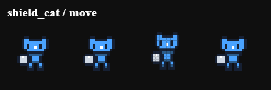
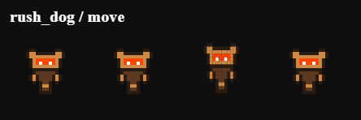
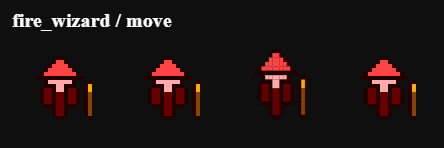
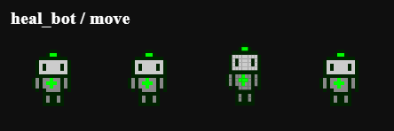
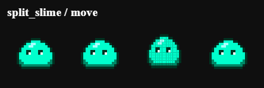
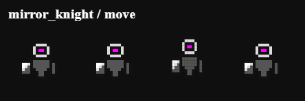

# Comment Battle Arena

一个开源的像素风角色物理自动对战模拟器。角色视觉上是 16x16 像素小人，底层使用圆形刚体碰撞，在封闭竞技场中自动移动、冲撞、反弹、释放技能。项目用于短视频连载和评论区共创角色。

## 当前项目定位

- **这不是传统手操小游戏**：玩家不直接控制角色移动或攻击。
- **这不是弹球游戏**：场上默认没有独立小球。核心是两个像素角色本身拥有圆形刚体物理特性。
- **配置化对战**：视频内容可以按 Episode 配置生成，自动演算战斗过程。
- **社区共创**：未来角色可以来自评论区投稿。

## 当前已实现功能 (MVP)

- Vite + TypeScript + Canvas 本地项目
- 自动对战 BattleEngine
- 圆形刚体物理系统（角色碰撞、墙体碰撞、冲量响应）
- 撞击伤害判定（基于相对速度，无持续挤压伤害）
- pair-based collision damage cooldown
- 动量维持机制（Constant Speed Correction）
- 6 个默认角色（具有不同物理特性和技能）
- Episode 配置系统 (作为 Published / Saved Match Preset)
- 纯代码像素矩阵角色渲染（16x16 matrix + palette）
- Transform Keyframes 动画系统（Linear Interpolation + Stepped Time Sampling）
- 像素风 projectile / effect (spark, heal, reflect)
- High-DPI (Retina) Canvas 文本渲染支持与 Times New Roman UI 字体
- Debug collider 可视化
- 战斗结果统计与复制功能 (Copy Episode Result)
- **Custom Match Setup** (自由选择左右角色、自定义 Seed 进行临时对战测试)
- **Pixel Sprite Previewer 开发工具** (支持矩阵解析、动画预览、导出 Animation Sheet)
- **CharacterConfig & Episode Draft Generator** (辅助快速生成角色配置代码)
- **矩阵编辑器的 `textarea` 保持等宽字体 (`monospace`) 以确保编辑时矩阵对齐，其他 UI 统一使用 Times New Roman。**

## 角色展示 (Character Showcase)

> **提示**: 以下展示的动作序列图 (Sprite Sheet) 可以通过运行 `npm run export:readme-sheets` 自动生成，或者通过 Pixel Sprite Previewer 的 **Export Animation Sheet** 功能手动导出。导出的 PNG 会自动保存在 `assets/readme/` 目录下。

### Shield Cat (盾盾猫)

**定位**：重装防御型，高护盾，慢速。
**视觉特征**：稳重的猫耳和左侧的重型盾牌。
**动作特点**：移动时沉稳，受击时盾牌会有明显的闪烁反馈。

- **Move**: 
  

### Rush Dog (冲刺狗)

**定位**：高速冲撞型，高冲量 Dash。
**视觉特征**：前倾的冲刺姿态和亮色的护目镜。
**动作特点**：移动时有强烈的向前倾斜感，冲刺（Dash）前会有短暂的蓄力（Charge）动作。

- **Move**: 
  

### Fire Wizard (火焰法师)

**定位**：远程风筝型，低血量，发射火球。
**视觉特征**：标志性的尖顶法师帽和带有发光宝石的法杖。
**动作特点**：移动时法杖会随之摆动，施法（Skill）时法杖宝石会高亮闪烁。

- **Move**: 
  

### Heal Bot (回血机器人)

**定位**：消耗防守型，自动回血。
**视觉特征**：方正的机械轮廓、分明的关节和胸前的绿色十字标志。
**动作特点**：移动时有机械的上下起伏感，回血时身上会冒出绿色十字粒子特效。

- **Move**: 
  

### Split Slime (分裂史莱姆)

**定位**：召唤消耗型，受击分裂小史莱姆。
**视觉特征**：圆润Q弹的果冻状半透明身体，内部有高光。
**动作特点**：移动时像果冻一样挤压拉伸（Squash and Stretch），受击时会剧烈形变并分裂。

- **Move**: 
  

### Mirror Knight (反伤骑士)

**定位**：防守反击型，概率反弹伤害。
**视觉特征**：挺拔的身躯和带有高光渐变的镜面盾牌。
**动作特点**：移动时步伐坚定，触发反弹（Reflect）时盾牌会发出强烈的闪光特效。

- **Move**: 
  

## 本地运行方式

1. 安装依赖：
  ```bash
   npm install
  ```
2. 启动开发服务器：
  ```bash
   npm run dev
  ```
3. 构建与测试：
  ```bash
   npm run build
   npx vitest run
  ```

## 项目结构树

```text
CommentBattleArena/
├─ src/
│  ├─ core/         # 核心引擎、物理、数学、类型定义
│  ├─ data/         # 角色配置、像素矩阵数据、对战剧本
│  ├─ entities/     # 游戏实体基类及派生类 (Character, Projectile, Effect 等)
│  ├─ rendering/    # 渲染器、像素动画系统
│  ├─ skills/       # 技能具体实现及注册表
│  ├─ app.ts        # 应用入口、UI 绑定
│  └─ main.ts       # 启动文件
├─ tests/           # 单元测试 (物理、伤害等)
├─ docs/            # 架构文档、ADR 记录
├─ README.md
├─ CONTEXT.md
├─ CHANGELOG.md
└─ package.json
```

## 核心系统说明

- **BattleEngine**：负责管理游戏主循环、实体更新、物理迭代、碰撞检测和胜负判定。
- **Physics / Collision**：负责处理圆形刚体碰撞、位置修正（防重叠）、冲量计算和撞击伤害判定。
- **CharacterEntity**：代表场上的战斗角色，维护生命值、速度、状态机，并执行速度修正逻辑。
- **Skill System**：事件驱动的技能系统，角色在特定时机（如 `onTick`, `onAttack`, `onDamageTaken`）触发注册的技能逻辑。
- **PixelCharacterRenderer**：负责将 16x16 的数字矩阵结合调色板渲染到 Canvas 上，并处理像素对齐。
- **Transform Keyframes**：动画系统，通过对极值点进行线性插值并按固定低帧率（如 8fps）阶梯化采样，实现复古像素动画。
- **Episode System**：作为 Published / Saved Match Preset，定义每期对战的双方角色、等级、队伍配置，用于正式发布和复现。

## 如何自由选择左右角色并启动自定义对战

在页面控制区下方有一个 **Custom Match Setup** 面板：

1. 在 **Left Character** 和 **Right Character** 下拉框中选择你想测试的角色（支持同角色内战）。
2. （可选）输入一个整数作为 **Seed**，如果不填则自动生成随机 Seed。
3. 点击 **Start Custom Match** 按钮即可立即启动这场临时对战。
4. 如果觉得这场对战很有趣，可以点击 **Copy Episode Draft**，将生成的配置代码粘贴到 `src/data/episodes.ts` 中永久保存。
5. 点击顶部的 **Prev Episode** 或 **Next Episode** 按钮，可以随时切回代码中固定的 Episode 剧本流程。

## 角色制作完整工作流 (Character Creation Workflow)

我们提供了一套完整的工具链，帮助你从零开始或基于参考图快速制作新角色，并立即在游戏中进行测试。推荐的制作顺序如下：

1. **打开预览器 (Open Previewer)**：点击页面底部的 **Open Pixel Sprite Previewer** 按钮。
2. **导入参考图 (Import Image)**：在左侧 **Import Image to Matrix v2** 区域，选择一张本地图片（如 PNG/JPG）。
   - **裁剪主体 (Crop)**：调整 Crop X/Y/Size，确保只框选角色主体。
   - **移除背景 (Remove Background)**：勾选 Remove Background，默认会自动提取左上角颜色作为背景色并透明化。白底或浅色背景会自动优先转为透明（Treat Near-White as Transparent），避免污染角色调色板。
   - **生成草稿 (Preview & Apply)**：点击 Preview Result，满意后点击 Apply to Matrix。导入结果只是草稿，不建议直接当最终角色。
3. **手动清理与调色 (Clean & Color)**：在左侧的文本框中修改 16x16 矩阵，清理杂乱像素；在右下角的 Palette Editor 中调整 7 色调色板。如果导入结果很脏，通常是因为图太复杂、主体太小、背景没有去掉或 16x16 尺寸无法保留细节。
4. **预览动画 (Preview Animation)**：在右上角的下拉框中切换不同动画状态（如 `move`, `attack`, `dash`），实时查看 Transform Keyframes 驱动的动态效果。
5. **导出定义 (Copy Definition)**：调整满意后，点击 **Copy Definition** 按钮。打开 `src/data/pixelSprites.ts`，将复制的代码粘贴进去，并注册到 `sprites` 对象中。
6. **生成配置 (Generate Config)**：在 Previewer 中间的生成器面板中，填写角色名称、设定，选择战斗风格模板（如 `aggressive_heavy`）和技能预设。点击 **Copy CharacterConfig Draft**，粘贴到 `src/data/characters.ts` 中，并根据需要微调物理属性。
7. **快速测试 (Custom Match Test)**：刷新页面，在 **Custom Match Setup** 面板的下拉框中直接选择你的新角色，点击 Start Custom Match 立即进行对战测试，**不必先写固定 Episode**。
8. **导出展示图 (Export README PNG)**：测试满意后，在 Previewer 中使用 **Export Animation Sheet** 导出动作序列图，或通过 `npm run export:readme-sheets` 批量导出，放到 `assets/readme/` 下用于展示。

### 关于矩阵解析器 (Matrix Parser)

Previewer 左侧的输入框支持极其宽松的解析格式：

- 优先提取 `matrix: [...]` 字段。
- 其次提取标准的 `[[...], [...]]` 二维数组。
- 最后会自动提取文本中的前 256 个有效数字 (0-7)。
- **注意**：如果粘贴的是完整的 Sprite Definition TypeScript 代码，解析器会自动忽略十六进制颜色值以防污染矩阵。但为了最佳体验，建议只粘贴矩阵部分，或直接使用 Load Existing Sprite。

## 像素矩阵规范

- **默认尺寸**：16x16
- **数字含义**：
  - 0 = transparent (透明)
  - 1 = outline (描边)
  - 2 = shadow (阴影)
  - 3 = main (主色)
  - 4 = highlight (高光)
  - 5 = accent (点缀色)
  - 6 = weapon (武器/配件)
  - 7 = effect (特效)

**注意**：视觉矩阵和圆形 collider 是完全独立的。矩阵只决定角色长什么样，物理碰撞由 `physics.radius` 等参数决定。

## 评论区角色投稿格式

观众可以在评论区按以下格式投稿新角色：

```text
角色名：
一句话设定：
外观特征：
球体/碰撞特性：(例如：极重且慢 / 极轻且弹)
战斗风格：(近战冲刺/远程风筝/防守反击/召唤等)
技能：
弱点：
想挑战谁：
是否原创：
```

## 当前 TODO / 下一阶段计划

- **更多技能接入 charge / skill 状态**：基础状态字段已接入，Rush Dog 已使用 charge，更多技能待进一步接入。
- **角色美术优化**：当前阶段重点从功能开发转向角色美术优化，6 个默认角色的像素外观正在打磨，并在 README 中新增了角色展示区。暂不推进 Publishing Helper。
- **更完整的 Previewer 使用示例和角色制作教程**。
- **技能和状态机测试覆盖**。

